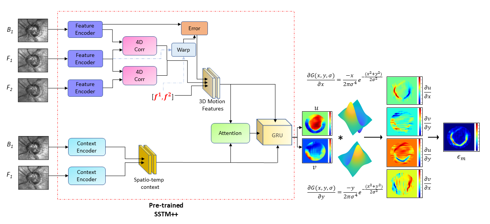
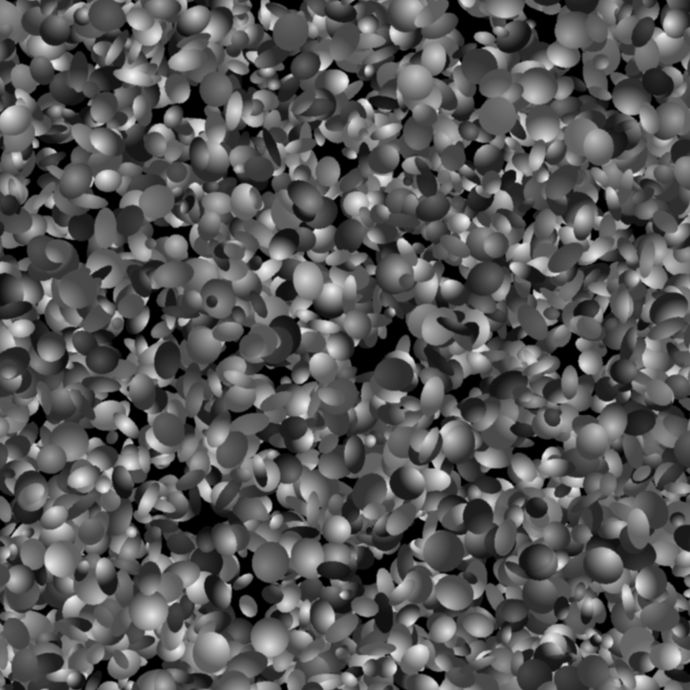
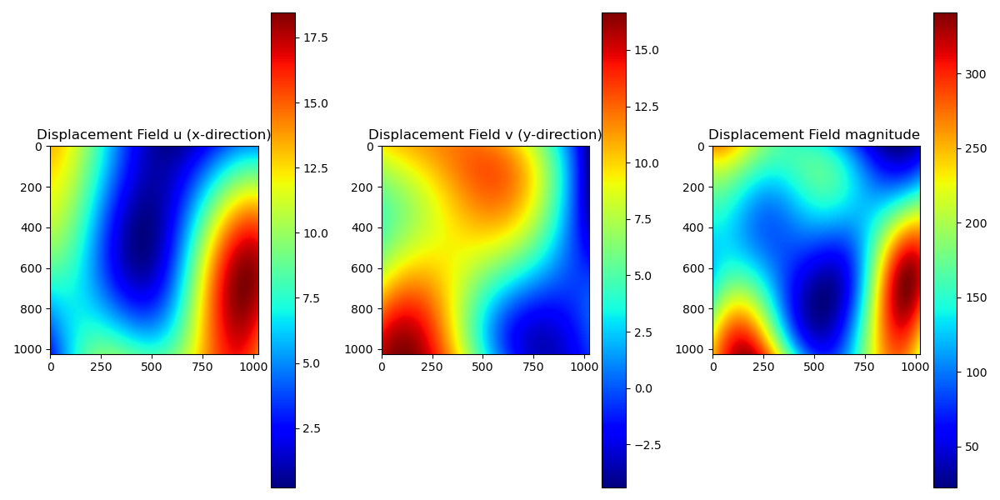

# KinemaNet
The deep learning processing pipeline shared in this repository extracts various kinematic features from non-invasive observations of deforming scenes (image sequences) as described in our paper:
> Fisseha A. Ferede, Madhusudhanan Balasubramanian, [*KinemaNet: Kinematic Descriptors of Deformation of the ONH for Non-invasive Detection of Glaucoma Progression*](https://computational-ocularscience.github.io/kinemanet.github.io/)

This repository contains:
- [KinemaNet](#kinemanet)
  - [I. KinemaNet Architecture](#i-kinemanet-architecture)
  - [II. Flow Estimation Using SSTM](#ii-flow-estimation-using-sstm)
    - [SSTM Installaion Instructions](#sstm-installaion-instructions)
  - [III. Validation Datesets with Known Ground Truths](#iii-validation-datesets-with-known-ground-truths)
    - [A. Specklegen for Synthetic Deforming Sequence Generation](#a-specklegen-for-synthetic-deforming-sequence-generation)
      - [Sample Demo](#sample-demo)
      - [Specklegen Installation](#specklegen-installation)
      - [Specklegen Usage Format](#specklegen-usage-format)
      - [Specklegen Usage Example](#specklegen-usage-example)
      - [Specklegen Output Format](#specklegen-output-format)
    - [B. Rubber Material Model](#b-rubber-material-model)
  - [V. Evaluation](#v-evaluation)
    - [Flow Evaluation](#flow-evaluation)
    - [Strain Evaluation](#strain-evaluation)
  - [VI. GUI for Visualizing Kinematics Descriptors](#vi-gui-for-visualizing-kinematics-descriptors)
  - [VII. Citation](#vii-citation)

## I. KinemaNet Architecture


The pipeline for generating kinematic features and descriptors of a deforming scene is comprised mainly of an optical flow estimation stage, and a strain tensor estimation stage.



## II. Flow Estimation Using SSTM

For deformation estimation in the KinemaNet pipeline, [**SSTM**](https://github.com/Computational-Ocularscience/SSTM), a multi-frame based optical flow estimation model, can be used to estimate pixel-level scene deformation from image sequences.

### SSTM Installaion Instructions
```bash
# Clone SSTM repository
git clone https://github.com/Computational-Ocularscience/SSTM.git
conda env create -f sstm.yml
conda activate sstm
python SSTM/evaluate.py --model=checkpoints/sstm_t++-sintel.pth --dataset=speckle/sequences
```

## III. Validation Datasets with Known Ground Truths

For evaluating the accuracy of model estimates, 1) synthetic deforming sequences were generated with known ground truth deformation fields; and 2) computational material models of deforming rubber specimen were developed where ground truth strain tensor at each material locations were available.

### A. *Specklegen* for Generating Synthetic Deforming Sequence

We generated multi-frame synthetic speckle pattern image sequences and ground-truth flows that represent the underlying deformation of the sequence. Each sequence has a unique reference pattern and contains between 9,000 and 11,000 randomly generated ellipses of varying sizes, with major and minor axes ranging from 7 to 30 pixels. These ellipses are fully filled with random gray scale intensity gradients ranging from 0 to 255. 

We then backward warp each unique pattern with smooth and randomly generated spatial random deformation fields to generate deforming sequences. The random deformation fields are generated using [GSTools](https://gmd.copernicus.org/articles/15/3161/2022/), a library which uses covariance model to generate spatial random fields. 

#### Sample Demo

<p align="center">
    <br>
   a) Deforming sequence <br>
    <br>
   b) Components of ground truth deformation fields ($u$, $v$)<br>
</p>

#### Specklegen Installation
Our speckle data generator is available as a package [Specklegen](https://pypi.org/project/specklegen/0.1.7/) on PyPI. Alternatively, this library can be installed as follows:

```bash
conda create -n specklegen_env python=3.8
pip install specklegen==0.1.7
```

#### Specklegen Usage Format

There are four arguments to be specified by the user. `--output_path` defines the directory where generated image sequences, ground-truth flows and flow vizualizations will be saved.  `--seq_number` and `--seq_length` represent the number of random speckle pattern sequences to generate and the number of frames per each sequence, respectively.
Lastly, the `--dimensions` argument specifies the height and width of the output speckle patterns. 
```
python specklegen\synthetic_data_generator.py
   --output_path=<output_path>
   --seq_number=5
   --seq_length=7
   --dimensions 512 512
   --scales 5 7
```
Alternatively, the speckle data generator is available as a package [Specklegen](https://pypi.org/project/specklegen/0.1.7/) on PyPI.

#### Specklegen Usage Example

```python
from specklegen.synthetic_data_generator import data_generator

# Define arguments
output_path = "./output" #output path
seq_number = 10 #number of sequences 
seq_length = 3 #number of frames per sequence
dimensions = (512, 512)  #output flow and sequence dimensions 
scales = (5, 7)  #max flow magnitudes of u and v fields, respectively

# Call function
data_generator(output_path, seq_number, seq_length, dimensions, scales)
```

#### Specklegen Output Format
The output files include synthetic speckle pattern image sequences, `.flo` ground truth deformation field which contains the `u` and `v` components of the flow, as well as flow visualizations file, heatmap of the `u` and `v` flows.

```
├── <output_path>/
│   ├── Sequences├──Seq1├──frame0001.png
│   │            │              .
│   │            │      ├──frame000n.png     
│   │            │ 
│   ├── Flow     ├──Seq1├──flow0001.flo
│   │            │              .
│   │            │      ├──frame000n-1.flo
│   │            │     
│   ├── Flow_vis ├──Seq1├──flow0001.png
│   │            │              .
│   │            │      ├──frame000n-1.png
```

### B. Rubber Material Model

To extract kinematic descriptor outputs from the COMSOL simulation results as described in the dataset section of [Rubber Material Modeling](https://computational-ocularscience.github.io/kinemanet.github.io/#rubber-material-modeling), clone the `fem` directory and follow the following instructions.
This program expects `*.csv` inputs from the COMSOL which can be downloaded from [Dataset page]((https://computational-ocularscience.github.io/kinemanet.github.io/#rubber-material-modeling)) for each of the four rubber geometries.

```matlab
clc; clear; close all;
addpath('fem');  % Add fem directory to path
femExtractor_v1; % Call the function
```
This will output kinematic descriptors `u, v, Exx, Eyy, Exy, Vorticity, Strain Magnitude` and `von Mises Strain` in `*.mat` file format and as colormaps for visualization purposes.

## V. Evaluation

### Flow Evaluation
Note: Using synthetic data with known deformation to validate the KinemaNet deformation fields

To compute ground truth strain estimates as well as evaluate your method (if any), run `evaluate_speckle` under eval directory:

```matlab
clc; clear; close all;
addpath('evaluation');  % Add eval directory to path
evaluate_speckle; % Call the function
```
If you're computing results for ground truth strain estimates only, set the variable `method_name` to `Flow`, a default path where generated ground truth flows are located.
Set `save_vis_strain = true` and `save_strain = true` to save gt and/or estimated strain maps as colormaps and `.mat` files, respectively.

To evaluate your flow and strain estimates (if any) of the test sepckle dataset, set the variable `method_name` to `my_method_name`, a path where your flow estimates are located.

### Strain Evaluation    
Note: using FE model generated flow estimates calculate the strain tensor vs FE estimated strain tensor

## VI. GUI for Visualizing Kinematics Descriptors 
```matlab
clc; clear; close all;
imageUploadGUI  % Launch the GUI
```
GUI demo video:

[](https://www.youtube.com/watch?v=RYcXPL-BuvE&list=PLwsd7wXvear8K4BZcjDVmZHCgSXQ2tv6c)


## VII. Citation

If you find this work useful please cite:
```
@article{ferede2023sstm,
  title={SSTM: Spatiotemporal recurrent transformers for multi-frame optical flow estimation},
  author={Ferede, Fisseha Admasu and Balasubramanian, Madhusudhanan},
  journal={Neurocomputing},
  volume={558},
  pages={126705},
  year={2023},
  publisher={Elsevier}
}
```
